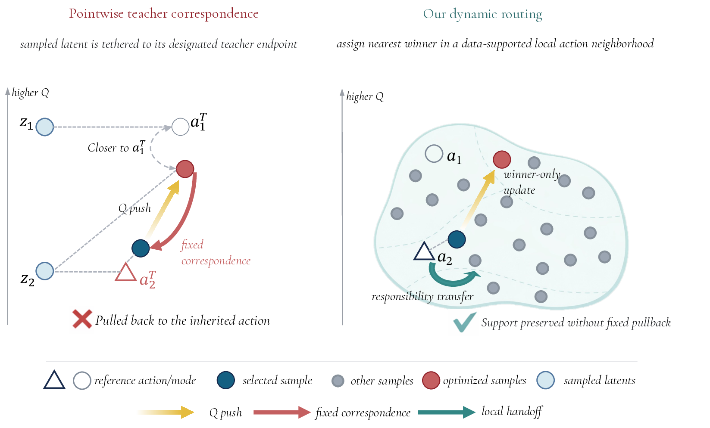

<div align="center">

<div id="user-content-toc" style="margin-bottom: 50px">
  <ul align="center" style="list-style: none;">
    <summary>
      <h1>Preserve Support, Not Correspondence:<br>Dynamic Routing for Offline Reinforcement Learning</h1>
      <br>
      <h2>DROL</h2>
    </summary>
  </ul>
</div>

<p>
  <a href="">arXiv</a>
  &emsp;
  <a href="https://muzhancun.github.io/preprints/DROL">Project Page</a>
</p>

<a href="assets/teaser.pdf">
  
</a>

</div>

## Overview

DROL is a one-step offline RL actor trained with top-1 dynamic routing. For each
state, the actor samples `K` candidate actions from a bounded latent prior,
routes the dataset action to its nearest candidate, and updates only the routed
winner with behavior cloning and critic guidance.

The key idea is to preserve **local action support** rather than a fixed
latent-to-target correspondence. Routing is recomputed every gradient step, so
responsibility for a supported action region can transfer between candidates as
optimization progresses. This lets the policy follow local Q improvements while
retaining cheap single-pass inference at test time.

This implementation is a minimal DROL-only extraction from the larger FQL
research codebase. It keeps the DROL agent, the OGBench/D4RL data path, training,
evaluation, logging, and production commands, while removing unrelated agents and
analysis scripts.

## Installation

The code uses the JAX/Flax training stack inherited from
[FQL](https://github.com/seohongpark/fql). Install the dependencies with:

```bash
pip install -r requirements.txt
```

For D4RL experiments, use the MuJoCo/D4RL setup expected by the pinned
dependencies in `requirements.txt`.

## Usage

The main DROL implementation is in [agents/drol.py](agents/drol.py). The
DROL-only training entrypoint is [main.py](main.py).

Run a default OGBench experiment from this folder:

```bash
python main.py --env_name=cube-double-play-singletask-v0
```

Example OGBench navigation run:

```bash
python main.py \
  --env_name=antmaze-large-navigate-singletask-task1-v0 \
  --agent.bc_coef=0.03 \
  --agent.num_candidates=16 \
  --agent.discount=0.995 \
  --agent.q_agg=min
```

Example D4RL run:

```bash
python main.py \
  --env_name=antmaze-medium-play-v2 \
  --offline_steps=500000 \
  --agent.bc_coef=0.1 \
  --agent.num_candidates=16
```

The default config path is `agents/drol.py`, so `--agent=agents/drol.py` is not
required for ordinary runs.

## Tips For Hyperparameter Tuning

The most important DROL hyperparameters are:

- `--agent.bc_coef`: support/behavior-cloning coefficient. Tune this first.
- `--agent.num_candidates`: routing budget `K`. The default paper setting is `K=16`.
- `--agent.q_agg`: critic aggregation. Some AntMaze and Adroit runs use `min`.
- `--agent.discount`: long-horizon OGBench navigation uses `0.995`.

In practice, fix `K=16` first and tune `bc_coef`. If additional budget is
available, sweep `K` after the workable `bc_coef` range is clear. Larger `K`
increases routing capacity, but it is not guaranteed to improve every task
monotonically.

Shared paper settings include Adam with learning rate `3e-4`, batch size `256`,
4-layer actor/critic MLPs with hidden widths `(512, 512, 512, 512)`, critic
ensemble size `2`, target update rate `0.005`, `1e6` offline updates on OGBench,
and `5e5` offline updates on D4RL.

## Reproducing The Main Results

The production command list is in
[scripts/production_run_commands.sh](scripts/production_run_commands.sh):

```bash
bash scripts/production_run_commands.sh
```

It contains the exact command groups used for:

- OGBench DROL(16), with fixed default `K=16`.
- OGBench DROL*, with family-level tuned `K`.
- D4RL DROL(16), with fixed default `K=16`.
- D4RL tuned supporting reruns.

The script has been adapted for this minimal folder and uses
`--agent=agents/drol.py`.

## Repository Layout

- `main.py`: DROL-only offline/offline-to-online training entrypoint.
- `agents/drol.py`: DROL agent, losses, action sampling, and config.
- `envs/`: OGBench and D4RL environment/dataset construction.
- `utils/`: dataset, evaluation, Flax, network, encoder, and logging helpers.
- `scripts/production_run_commands.sh`: paper production commands.
- `requirements.txt`: dependency pins copied from the source repository.

Dataset artifacts are not copied into this folder. OGBench and D4RL loading
still follows the package/local-data behavior of the original FQL repository.

## Acknowledgments

This codebase is built on top of
[Flow Q-Learning](https://github.com/seohongpark/fql). DROL reuses the FQL-style
JAX training stack and one-step flow actor infrastructure, while replacing the
actor-side support regularizer with dynamic routing.
